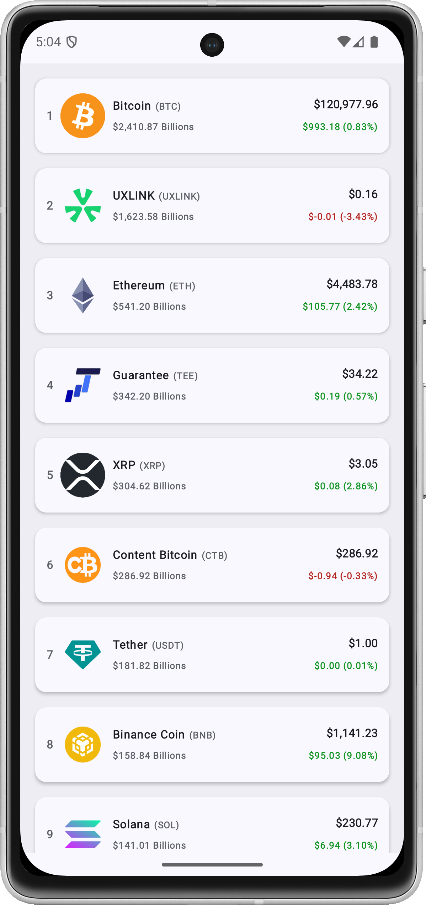
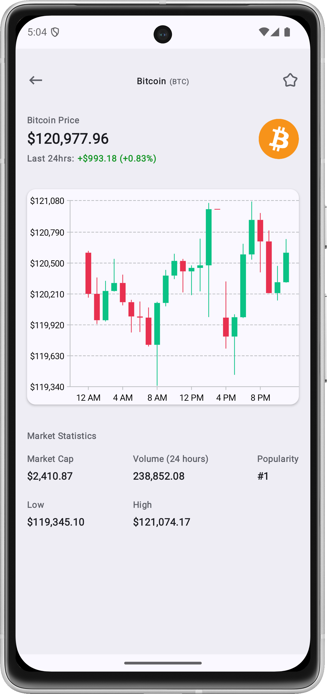
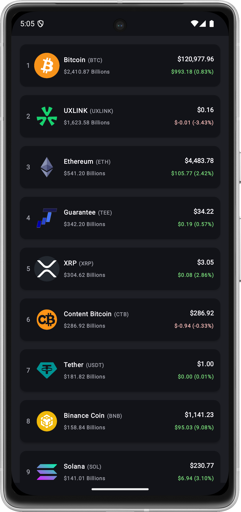
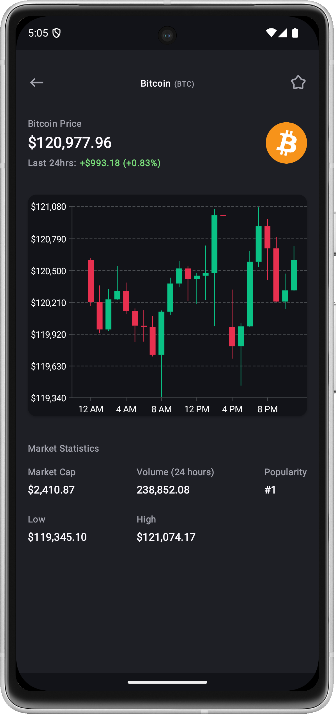
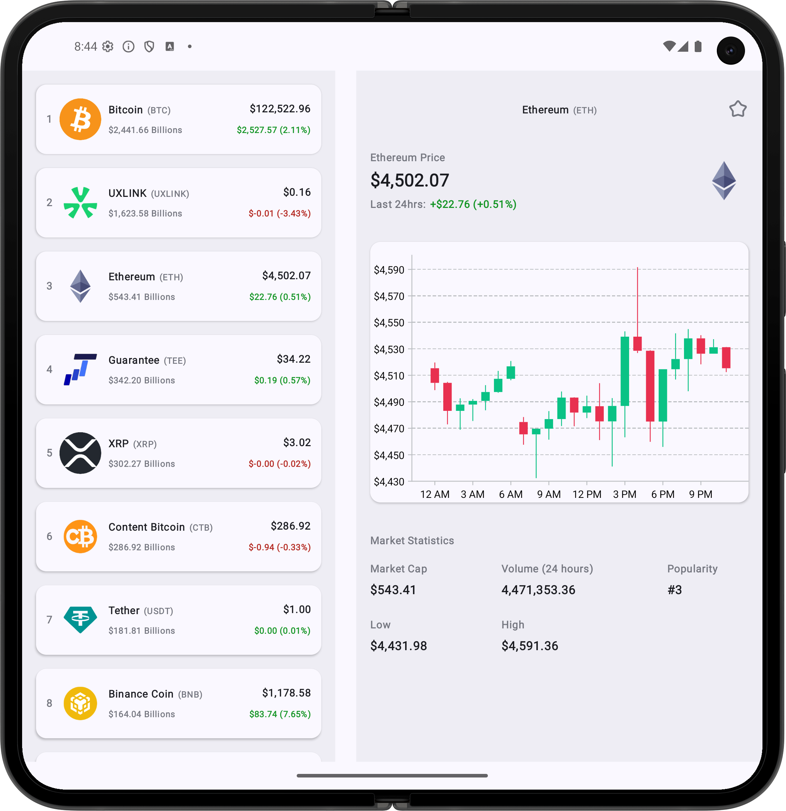
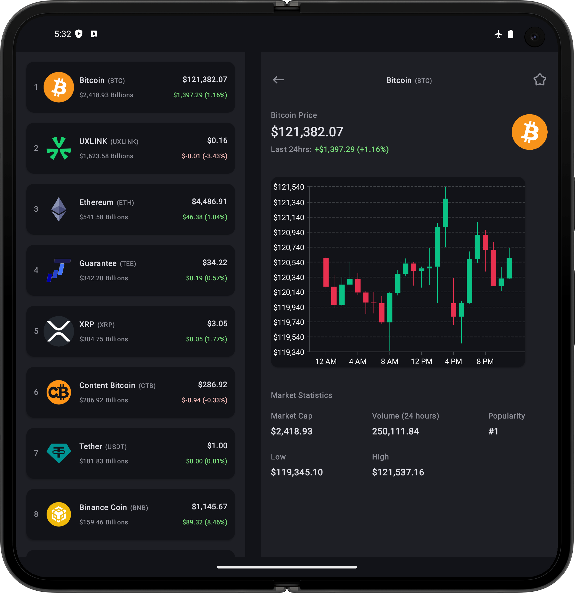

# Crypto App

Crypto App is an Android application designed to track cryptocurrency information and market news.
It uses Clean Architecture and a modular structure to keep data, domain, and presentation concerns
separated. Users can browse a list of cryptocurrencies, view details for specific coins, and read
the latest crypto news.

## Features

* **Browse Cryptocurrencies:** Displays a paginated list of available cryptocurrencies.
* **View Coin Details:** Shows detailed information for a selected cryptocurrency, potentially
  including price charts.
* **Read Crypto News:** Provides a paginated news feed with article details, images, categories,
  source information, and links to original articles.
* **Offline Caching:** Utilizes local databases to cache cryptocurrency and news data for offline
  access and faster loading.
* **Modern and Adaptive UI:** Leverages Jetpack Compose to create a responsive user interface that
  adapts to different screen sizes and orientations, effectively implementing patterns like
  list-detail views for optimal user experience on both phones and tablets.
* **Top-Level Navigation:** Uses adaptive bottom navigation or navigation rail destinations for
  switching between coins and news.

<table>
  <tr>
    <td style="text-align: center;">
      
    </td>
    <td style="text-align: center;">
      
    </td>
    <td style="text-align: center;">
      
    </td>
    <td style="text-align: center;">
      
    </td>
  </tr>
  <tr>
    <td colspan="2" style="text-align: center;">
      
    </td>
    <td colspan="2" style="text-align: center;">
      
    </td>
  </tr>
</table>

## Architecture

The core idea is that the **Domain layer is the center of the architecture**, and both the
Presentation and Data layers depend on it, but the Domain layer does not depend on them.

```

+---------------------+      +---------------------+      +---------------------+
|  Presentation Layer |----->|    Domain Layer     |<-----|     Data Layer      |
+---------------------+      +---------------------+      +---------------------+

```

* **Data Layer:** Responsible for providing data to the application, whether from a remote API or a
  local database. It includes implementations of repository interfaces defined in the Domain layer.
* **Domain Layer:** Contains the business logic of the application, including use cases, domain
  models, and repository interfaces. It is independent of the Android framework and any other layer.
* **Presentation Layer:** Handles the UI and user interaction, using an **MVVM (
  Model-View-ViewModel)** pattern. It interacts with the Domain layer through use cases.

## Tech Stack & Libraries

* **Kotlin:** Primary programming language.
* **Jetpack Compose:** For building the UI.
* **Coroutines & Flow:** For asynchronous programming.
* **Retrofit + Moshi:** For API requests and JSON serialization/deserialization.
* **Room:** For local data persistence (caching).
* **Paging 3:** For efficiently loading and displaying large lists of data.
* **Hilt:** For dependency injection.
* **Konsist:** For enforcing code consistency and architectural rules.

## Modules

* **`app`:** The main application module, responsible for putting together all the features and core
  components.
* **`core`:** Contains shared code and utilities used across multiple feature modules.
    * `core/data`: Shared networking and data infrastructure (Retrofit/Moshi/OkHttp setup,
      network error mapping, and reusable request wrappers), plus common data components.
    * `core/domain`: Core domain logic or models.
    * `core/presentation`: Core UI components, themes, or presentation utilities.
* **`feature/crypto`:** A feature module dedicated to cryptocurrency-related functionalities.
    * `feature/crypto/data`: Data sources and repositories specific to the crypto feature.
    * `feature/crypto/domain`: Use cases and domain models for the crypto feature.
    * `feature/crypto/presentation`: ViewModels, Composable screens, and UI models for the crypto
      feature.
* **`feature/news`:** A feature module dedicated to crypto news browsing.
    * `feature/news/data`: Remote news API integration, local Room cache, paging mediator, and
      repository implementation for news articles.
    * `feature/news/domain`: News article models, use cases, and repository contracts.
    * `feature/news/presentation`: ViewModels, Composable list/detail screens, and UI models for the
      news feature.
